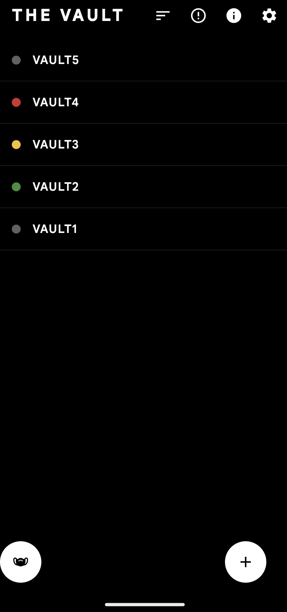
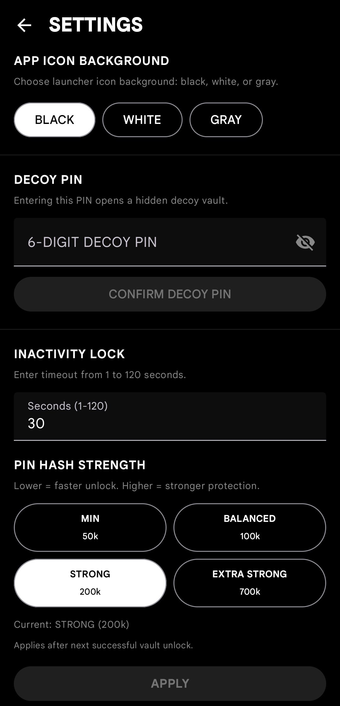
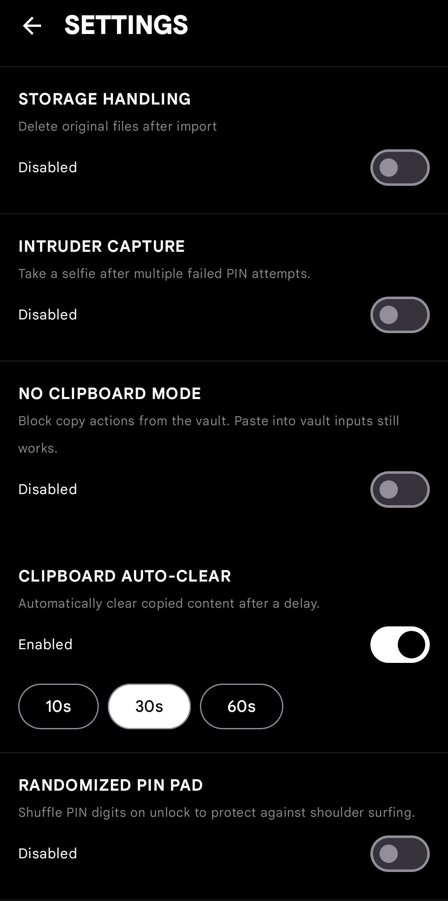
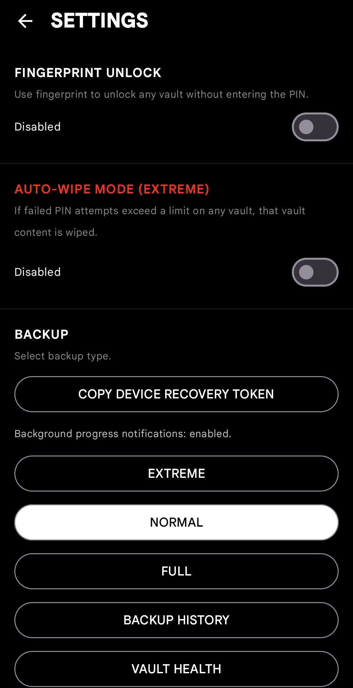

# The Vault

The Vault is a local-first Android app for storing sensitive information. It focuses on on-device security, discreet access, and encrypted backups while keeping your data offline.

## Highlights
- Multi-vault organization with folders and tags
- Encrypted content fields (AES-GCM) with per-vault keys stored in Android Keystore
- Biometric unlock and strict biometric mode per vault
- Decoy vault and panic PIN support
- Stealth app icon disguises
- Intruder selfie capture after failed unlock attempts
- Auto-lock, lockout protection, and inactivity timeout
- Secure clipboard clearing for copied secrets
- Offline encrypted backups (`.vltbck`) with recovery phrase support

## Screenshots
<p align="center">
  
  
  
  
</p>

## Tech Stack
- Kotlin + Jetpack Compose
- Room (local database)
- AndroidX Security Crypto
- Koin (dependency injection)
- WorkManager
- CameraX (intruder capture)
- BouncyCastle + Zstd (backup crypto and compression)

## Requirements
- Android Studio (latest stable)
- JDK 11
- Android SDK 34
- Device or emulator with API 26+

## Build And Run
1. Clone the repo.
2. Open the project in Android Studio and sync Gradle.
3. Build a debug APK.

```bash
./gradlew assembleDebug
```

4. Install on a device or emulator.

```bash
./gradlew installDebug
```

## Release Signing
Copy `keystore.properties.example` to `keystore.properties`, fill in your values, then build:

```bash
./gradlew assembleRelease
```

## Permissions
- Camera: intruder capture when enabled
- Biometric: unlock and strict biometric mode
- Notifications and foreground service: long-running backup tasks
- Vibrate: UI feedback

## Security Notes
- The app stores data on-device and does not request network permissions.
- Sensitive fields are encrypted before storage. Metadata like item names or descriptions may remain plaintext.
- Files are stored in app-private storage and deleted with a best-effort secure wipe.
- Backups are encrypted and include integrity checks. Store recovery phrases securely.

## Contributing
See `CONTRIBUTING.md`.

## License
All rights reserved. See `LICENSE`.
